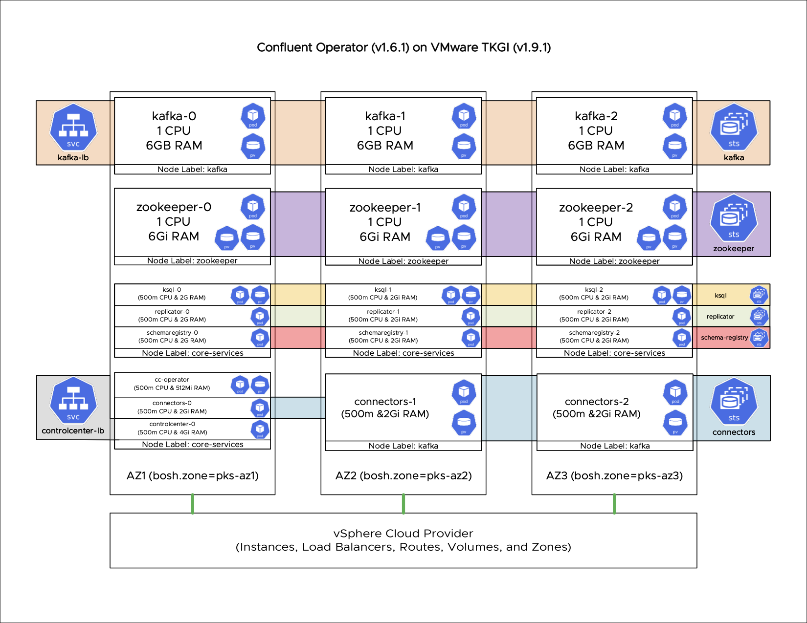

# Confluent Operator on VMware Tanzu Kubernetes Grid Integrated Edition

## Overview

Best practices, guidance, examples, diagrams, and all the good knowledge one needs to have success with the Confluent Operator on VMware TKGI.

## Prior Releases and Versions

Check the [Releases Page](https://github.com/jbogie-vmware/tkgi-confluent-operator/releases/) for previous versions and tested configurations.

## Reference Architecture and Planning Topics

### Confluent Operator on VMware Tanzu Kubernetes Grid Integrated Edition Reference Architecture

[Higher Resolution PDF Version](/ref-arch-diagram/Confluent-Operator-TKGI-Reference-Architecture-Diagram.pdf)

### Environment Assets

- VMware vSphere v7.0
- VMware Tanzu Kubernetes Grid Integrated Edition v1.9.1
- VMware NSX-T v3.0.2
- VMware Harbor 2.0.4
- Confluent Operator v1.6.1

### Cluster Sizing

The intent of these recommendations is to provide a minimum environment in which a team could begin developing, testing, and deploying applications that leverage Confluent Platform services on Kubernetes provided by the Confluent Operator. These are not production environment sizing recommendations. For guidance on sizing an environment for production workloads please refer to the following assets from Confluent.

[Confluent Operator Environment Sizing](https://docs.confluent.io/current/installation/operator/co-plan.html#co-env-sizing)

[Confluent Platform System Requirements](https://docs.confluent.io/current/installation/system-requirements.html)

We recommend a minimum of 12 worker nodes with 2 CPUs and 8 GB of RAM per node. This will provide a balanced number of nodes across the minimum recommended 3 availability zones. Building these recommendations was performed on a single server with TKGI & NSX-T Pre-Installed - vSphere (7.0 GA), TKGI (1.8), NSX-T (3.0), Harbor (1.10.1) A plan was created in TKGI to match this configuration and the plan was named `confluent-operator`. Worker nodes were of the `large.disk` node type.

### General Node & Pod Sizing Guidance

- **TODO** #1 Node sizing for minimum environment (Test/Dev)
- **TODO** #2 Create best practice for baseline pod sizing (CPU/RAM)

### Persistence and Storage Guidance

- **TODO** #3 vSphere-volume provider explanation (thin/thick/eager)
- **TODO** #4 vSAN considerations (describe cache tier and data protection/performance options)

### High Availability Considerations

- **TODO** #5 Anti-Affinity best practices and examples for paired or clustered pods (Kafka / Zookeeper / SchemaRegistry / Connect)
- **TODO** #6 Availability zone layout and best practices with examples

### Security Considerations

- **TODO** #7 Securing Confluent Operator on TKGI best practices & examples. (Securing Authentication, Certificates, SASL, TLS/mTLS)

### Network Considerations

[Load Balancing Ingress Traffic with NSX-T](network-topics/README.md)

[//]: # (Create guidelines for deploying Confluent Operator on TKGI w/o NSX - Flannel, HAProxy Ingress, etc)

## Installation Guidance

[Install Guidance Docs](/install/README.md)
